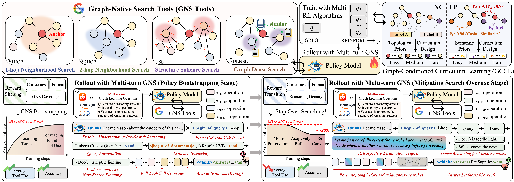

  

  

---

## To Reviewers

1. **Typo in the paper (Subsection 4.3).**  
   We noticed a typo in the paper: **"Training Proces" → "Training Process"**.  
   Due to the tight submission deadline, we accidentally removed an extra **"s"** during the final revision. We sincerely apologize and hope this does not affect your understanding of our method.

2. **Code usage during the review period.**  
   This codebase is intended **only for the review process**. We retain the core implementation and replace paths/configs with placeholders for anonymization and sanitization.  
   We will release a **one-click runnable** version after the review process concludes.

---

## Layout

- `OpenRLHF-RAG/`: OpenRLHF core with graph-native search extensions  
- `train/`: dataset builders and utility scripts  
- `evaluation/`: evaluation drivers and metrics  
- `scripts/`: training and orchestration scripts  

---

## Quick Start (high level)

1. Prepare graph artifacts and model checkpoints (paths are placeholders in scripts).  
2. Run training scripts under `scripts/`.  
3. Use `evaluation/` tools to generate and score results.  

---

## Acknowledgements

1. We thank **[OpenRLHF][openrlhf]** for providing an easy-to-use RL training framework.  
2. We thank **[R1-Searcher][r1-searcher]** for supporting and inspiring the search-related extensions.  
   Thank you for your wonderful work!

[openrlhf]: https://github.com/OpenRLHF/OpenRLHF
[r1-searcher]: https://github.com/RUCAIBox/R1-Searcher

