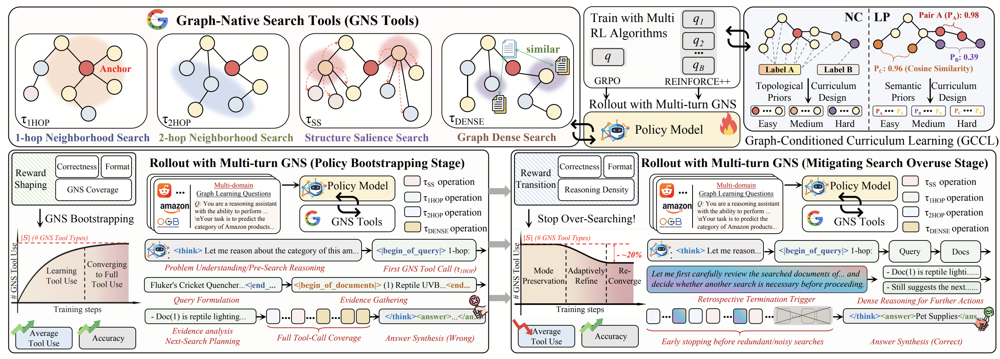

<h1 align="center">AgentGL: Towards Agentic Graph Learning with LLMs via Reinforcement Learning</h1>

<p align="center">
  <a href="https://arxiv.org/abs/2604.05846">
    
  </a>
</p>

<p align="center">
  <a href="#overview">Overview</a> •
  <a href="#installation">Installation</a> •
  <a href="#configuration">Configuration</a> •
  <a href="#data-construction">Data Construction</a> •
  <a href="#services">Services</a> •
  <a href="#training-scripts">Training Scripts</a> •
  <a href="#evaluation">Evaluation</a> •
  <a href="#citation">Citation</a>
</p>

<p align="center">
  
</p>

## Overview

**AgentGL** is an RL-driven framework for **Agentic Graph Learning (AGL)**. It enables LLM agents to solve graph learning tasks by dynamically exploring text-attributed graphs, retrieving topology-aware evidence, and reasoning over the collected information.

Unlike static GraphLLM or GraphRAG pipelines, AgentGL performs **interleaved graph search and reasoning**. It provides the agent with graph-native search tools for local neighborhood exploration, multi-hop traversal, global structural probing, and dense semantic retrieval. This allows the model to adaptively acquire task-relevant evidence from both graph topology and node text.

AgentGL is trained with a two-stage reinforcement learning pipeline: first, it bootstraps graph-native tool-use behaviors; then, it mitigates search overuse by encouraging the agent to reason more carefully before issuing additional searches. A graph-conditioned curriculum further stabilizes training by organizing examples according to structural and semantic difficulty.

Experiments across diverse text-attributed graph benchmarks show that AgentGL substantially improves over strong GNN, GraphLLM, GraphRAG, and agentic-search baselines on node classification and link prediction.

## Repository Layout

```text
AgentGL/
  config/agentgl.env              # default, portable runtime configuration
  data_construction/              # utilities for rebuilding prepared JSONL data
  data/                           # empty output directory for generated JSONL files
  evaluation/                     # vLLM graph-search evaluation scripts
  local_launchers/                # optional local launcher examples
  OpenRLHF-RAG/                   # OpenRLHF fork used by AgentGL training
  prompt_templates/               # NC and LP prompt templates
  scripts/                        # exactly eight release training scripts
  train/                          # reward servers and runtime services
```

The graph artifact directory is separate from generated JSONL files. Set `AGENTGL_NODE_DATA_ROOT` to a directory named `node_data` containing per-dataset folders such as `ogbn-arxiv/`, `ogbn-products/`, `amazon-photo/`, etc. Each folder is expected to contain graph files such as `node_texts.json`, `category.json`, `first_hop_indices.json`, and cached embeddings if available (you can download this data based on the instructions in **Data Construction**). 

## Installation

Use Python 3.10+ with CUDA-capable PyTorch. The exact CUDA, PyTorch, vLLM, and FlashAttention versions should match your cluster image.

```bash
git clone <repo-url> AgentGL
cd AgentGL

conda create -n agentgl python=3.10
conda activate agentgl

pip install -r requirements.txt
```

Alternatively, you can also set up the environment following the [R1-Searcher project](https://github.com/RUCAIBox/R1-Searcher) and then adjust some dependencies.

## Configuration

The release scripts read `config/agentgl.env` and allow every path to be overridden by environment variables.

Common variables:

```bash
export AGENTGL_NODE_DATA_ROOT=/path/to/node_data
export AGENTGL_GRAPH_ENCODER_PATH=/path/to/all-roberta-large-v1
export AGENTGL_OUTPUT_ROOT=$PWD/outputs
export AGENTGL_RAY_ADDRESS=http://127.0.0.1:8267
export AGENTGL_REWARD_PORT=1278
export AGENTGL_GRAPH_ENCODER_REMOTE_URL=http://127.0.0.1:9100/encode
```

Optional base model overrides:

```bash
export AGENTGL_BASE_MODEL_NC_GRPO_STAGE1=Qwen/Qwen2.5-3B-Instruct
export AGENTGL_BASE_MODEL_NC_REINFORCEPP_STAGE1=Qwen/Qwen2.5-7B-Instruct
export AGENTGL_BASE_MODEL_LP_GRPO_STAGE1=Qwen/Qwen2.5-3B-Instruct
export AGENTGL_BASE_MODEL_LP_REINFORCEPP_STAGE1=Qwen/Qwen2.5-3B-Instruct
```

Stage 2 scripts default to the matching Stage 1 checkpoint under `${AGENTGL_OUTPUT_ROOT}/ckpts/`. To resume from a different checkpoint, set the matching variable, for example:

```bash
export AGENTGL_NC_GRPO_STAGE2_MODEL=/path/to/agentgl_nc_grpo_stage1
```

W&B is disabled unless you provide a key:

```bash
export AGENTGL_WANDB_API_KEY=<your-key>
```


## Data Construction

The repository keeps `data/` empty. Generate JSONL files locally before training or evaluation.

Download the original graph artifacts and edge-index files from the [Google Drive data folder](https://drive.google.com/drive/folders/1w_Jh4DMyBWEj186yEsrXZ0532fVP8Jpz).

After downloading, place the extracted data folders in the project root. The node artifact folder should be named `node_data`, and the edge-index folder should be named `edge_indices`:

Then set the paths used by the data construction scripts. Replace the placeholder paths with your own local paths:

```bash
export AGENTGL_NODE_DATA_ROOT="$PWD/node_data"
export AGENTGL_EDGE_DATA_ROOT="$PWD/edge_indices"
export AGENTGL_GRAPH_ENCODER_PATH=/path/to/all-roberta-large-v1
export AGENTGL_DATA_SEED=<YOUR_SEED>
```

### NC Data

NC data is generated by `data_construction/generate_datasets_from_splits.py`. It reads `node_texts.json`, `category.json`, `first_hop_indices.json`, and `splits.json` from each dataset folder. Stage 1 samples train nodes by difficulty; Stage 2 samples medium/hard train nodes while excluding Stage 1 and evaluation nodes.

```bash
# Sampled NC evaluation set.
python data_construction/generate_datasets_from_splits.py \
  --node-data-root "$AGENTGL_NODE_DATA_ROOT" \
  --datasets ogbn-arxiv,ogbn-products,amazon-computers,amazon-photo,arxiv_2023,pubmed,reddit \
  --mode eval \
  --seed "$AGENTGL_DATA_SEED" \
  --eval-split test \
  --eval-size 1000 \
  --output-dir data/eval_set

# Full NC evaluation set. The script uses all available nodes if the requested
# size is larger than the split.
python data_construction/generate_datasets_from_splits.py \
  --node-data-root "$AGENTGL_NODE_DATA_ROOT" \
  --datasets ogbn-arxiv,ogbn-products,amazon-computers,amazon-photo,arxiv_2023,pubmed,reddit \
  --mode eval \
  --seed "$AGENTGL_DATA_SEED" \
  --eval-split test \
  --eval-size 100000000 \
  --output-dir data/eval_set_all

# Raw NC training stages.
python data_construction/generate_datasets_from_splits.py \
  --node-data-root "$AGENTGL_NODE_DATA_ROOT" \
  --datasets ogbn-arxiv,ogbn-products \
  --mode stage1 \
  --seed "$AGENTGL_DATA_SEED" \
  --stage1-easy 1000 \
  --stage1-medium 500 \
  --stage1-hard 500 \
  --output-dir data/training_set

python data_construction/generate_datasets_from_splits.py \
  --node-data-root "$AGENTGL_NODE_DATA_ROOT" \
  --datasets ogbn-arxiv,ogbn-products \
  --mode stage2 \
  --seed "$AGENTGL_DATA_SEED" \
  --stage1-files data/training_set/ogbn-arxiv_stage1_2000.jsonl,data/training_set/ogbn-products_stage1_2000.jsonl \
  --eval-dir data/eval_set \
  --stage2-medium 500 \
  --stage2-hard 500 \
  --output-dir data/training_set
```

The NC training scripts read the generated files in `data/training_set/` by default. If you want a different stage distribution, sample from `data/training_set/` with your own policy and override the matching `AGENTGL_NC_*_DATA_PATH` variable.

### LP Data

LP data is generated by `data_construction/build_lp_datasets.py`. It reads `node_texts.json`, `first_hop_indices.json`, `second_hop_indices.json`, optional `pagerank.npy` and `node_emb.npy` from `node_data`, and original edge-index files from `AGENTGL_EDGE_DATA_ROOT`.

```bash
# Raw LP train/test pairs and retrieval metadata.
python data_construction/build_lp_datasets.py \
  --node-data-root "$AGENTGL_NODE_DATA_ROOT" \
  --edge-dir "$AGENTGL_EDGE_DATA_ROOT" \
  --output-dir data/link_prediction \
  --model-path "$AGENTGL_GRAPH_ENCODER_PATH" \
  --device cuda:0 \
  --seed "$AGENTGL_DATA_SEED" \
  --train-datasets ogbn-arxiv,ogbn-products \
  --test-datasets ogbn-arxiv,ogbn-products,amazon-computers,amazon-photo,arxiv_2023,pubmed,reddit \
  --train-num-positive 1500 \
  --train-num-negative 1500 \
  --test-num-positive 500 \
  --test-num-negative 500 \
  --similar-top-k 10

# LP stage files used by scripts/train_lp_*.sh.
python data_construction/build_lp_stage_datasets.py \
  --datasets ogbn-arxiv,ogbn-products \
  --input-root data/link_prediction \
  --output-dir data/link_prediction_stage \
  --stage1-difficulties easy,medium \
  --stage2-difficulties medium,hard \
  --force
```

If `node_emb.npy` is missing for a dataset, `build_lp_datasets.py` encodes the needed node texts with `AGENTGL_GRAPH_ENCODER_PATH`. You can precompute and cache those embeddings with `data_construction/precompute_graph_embeddings.py` when building data repeatedly.

## Services

Start the embedding service:

```bash
python train/embedding_server.py \
  --model_path "$AGENTGL_GRAPH_ENCODER_PATH" \
  --device cuda:7 \
  --port 9100
```

Start the NC reward server:

```bash
# Stage 1
python train/reward_server_qwen_zero.py \
  --data_path "$AGENTGL_NODE_DATA_ROOT/ogbn-arxiv,$AGENTGL_NODE_DATA_ROOT/ogbn-products" \
  --port 1278 \
  --log_file logs/reward_nc_stage1.jsonl

# Stage 2
python train/reward_server_qwen_stage2.py \
  --data_path "$AGENTGL_NODE_DATA_ROOT/ogbn-arxiv,$AGENTGL_NODE_DATA_ROOT/ogbn-products" \
  --port 1278 \
  --log_file logs/reward_nc_stage2.jsonl
```

Start the LP reward server:

```bash
# Stage 1
python train/reward_server_lp.py \
  --pair_data "data/link_prediction/ogbn-arxiv/train.jsonl,data/link_prediction/ogbn-products/train.jsonl" \
  --port 1278 \
  --log_file logs/reward_lp_stage1.jsonl

# Stage 2
python train/reward_server_lp_stage2.py \
  --pair_data "data/link_prediction/ogbn-arxiv/train.jsonl,data/link_prediction/ogbn-products/train.jsonl" \
  --port 1278 \
  --log_file logs/reward_lp_stage2.jsonl
```

Start Ray before submitting a training job:

```bash
ray start --head --num-gpus 8 --port 8266 --dashboard-port 8267
```

## Training Scripts

We use 8 h100 GPUs to finsih the training process.

There are exactly eight release training scripts:

| Task | Algorithm | Stage | Script |
| --- | --- | --- | --- |
| NC | GRPO | Stage 1 | `scripts/train_nc_grpo_stage1.sh` |
| NC | GRPO | Stage 2 | `scripts/train_nc_grpo_stage2.sh` |
| NC | REINFORCE++ | Stage 1 | `scripts/train_nc_reinforcepp_stage1.sh` |
| NC | REINFORCE++ | Stage 2 | `scripts/train_nc_reinforcepp_stage2.sh` |
| LP | GRPO | Stage 1 | `scripts/train_lp_grpo_stage1.sh` |
| LP | GRPO | Stage 2 | `scripts/train_lp_grpo_stage2.sh` |
| LP | REINFORCE++ | Stage 1 | `scripts/train_lp_reinforcepp_stage1.sh` |
| LP | REINFORCE++ | Stage 2 | `scripts/train_lp_reinforcepp_stage2.sh` |

Example NC GRPO run:

```bash
bash scripts/train_nc_grpo_stage1.sh
bash scripts/train_nc_grpo_stage2.sh
```

Example LP REINFORCE++ run:

```bash
bash scripts/train_lp_reinforcepp_stage1.sh
bash scripts/train_lp_reinforcepp_stage2.sh
```

All scripts use generated JSONL files under `data/`. They do not regenerate training data.

## Evaluation

NC evaluation across multiple datasets:

```bash
python evaluation/run_eval_suite.py \
  --datasets ogbn-arxiv,ogbn-products,amazon-computers,amazon-photo,arxiv_2023,pubmed,reddit \
  --eval_dir data/eval_set \
  --graph_data_root "$AGENTGL_NODE_DATA_ROOT" \
  --output_dir data/eval_results \
  --output_suffix _agentgl_nc_grpo_stage2.jsonl \
  --model "$AGENTGL_OUTPUT_ROOT/ckpts/agentgl_nc_grpo_stage2" \
  --tokenizer "$AGENTGL_OUTPUT_ROOT/ckpts/agentgl_nc_grpo_stage2" \
  --graph_encoder_path "$AGENTGL_GRAPH_ENCODER_PATH" \
  --head 1000 \
  --batch-size 128 \
  --tensor-parallel-size 2
```

LP evaluation on one dataset:

```bash
python evaluation/eval_gs.py \
  --graph-task link \
  --model "$AGENTGL_OUTPUT_ROOT/ckpts/agentgl_lp_grpo_stage2" \
  --tokenizer "$AGENTGL_OUTPUT_ROOT/ckpts/agentgl_lp_grpo_stage2" \
  --graph-data-dir "data/link_prediction/ogbn-arxiv/train.jsonl,data/link_prediction/ogbn-arxiv/test.jsonl" \
  --lp-node-data-root "$AGENTGL_NODE_DATA_ROOT" \
  --eval-file data/link_prediction/ogbn-arxiv/test.jsonl \
  --output-file data/eval_results/ogbn-arxiv_agentgl_lp_grpo_stage2.jsonl \
  --graph-encoder-path "$AGENTGL_GRAPH_ENCODER_PATH" \
  --tensor-parallel-size 2
```

Compute exact-match accuracy from an evaluation output:

```bash
python evaluation/metric_acc.py --input data/eval_results/ogbn-arxiv_agentgl_lp_grpo_stage2.jsonl
```

## Local Convenience Launchers

The `local_launchers/` folder contains optional example wrappers that source `local_launchers/agentgl_local.env`, start the embedding server, reward server, and Ray, then call the matching release training script.

Edit the placeholder paths in `local_launchers/agentgl_local.env`, then run one of:

```bash
bash local_launchers/run_nc_grpo_stage1.sh
bash local_launchers/run_nc_grpo_stage2.sh
bash local_launchers/run_lp_grpo_stage1.sh
bash local_launchers/run_lp_grpo_stage2.sh
```

## Notes

- The training scripts assume the reward server and embedding server are reachable from the Ray workers.
- `AGENTGL_NODE_DATA_ROOT` must match the datasets used by the prepared JSONL files.
- Stage 2 scripts are intended to run after the matching Stage 1 script unless you override the Stage 2 model path.
- Historical evaluation outputs, caches, and logs are ignored by git and can be regenerated.

## Citation

If you find AgentGL useful, please cite our paper💗:

```bibtex
@article{sun2026agentgl,
  title={Agentgl: Towards agentic graph learning with llms via reinforcement learning},
  author={Sun, Yuanfu and Li, Kang and Fan, Dongzhe and Liu, Jiajin and Tan, Qiaoyu},
  journal={arXiv preprint arXiv:2604.05846},
  year={2026}
}
```

## Acknowledgements

AgentGL builds on ideas and code structure from [R1-Searcher](https://github.com/RUCAIBox/R1-Searcher). We sincerely thank the R1-Searcher authors for releasing their codebase, which provided valuable foundations for this project.
